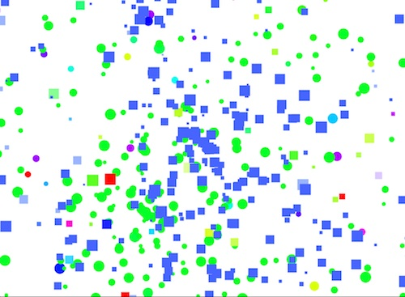

#Bubbles Exercise

Alex Esposito 4/20/15

This project tracks the mouse movement and changes the colors of emmiting squares and circles based on its location.

The code has a class named Bubble in it which has the ability to either draw circles or rectangles and update its position which allows us to create a particle generator with ease.

The squares emmit from the middle of the screen while the circles emmit from the position of the mouse. The color of both is dictated by the movement in a HSB color grid mapping the screen to the 0 to 255 ratio.